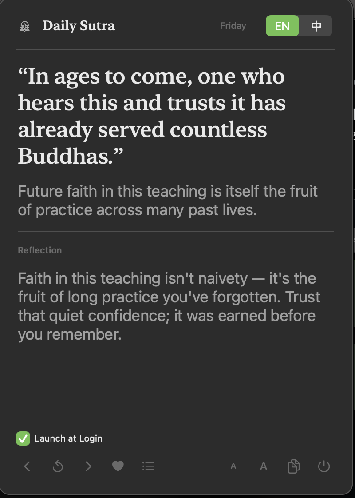

# Daily Sutra



A macOS menu bar app that shows a daily contemplative verse drawn randomly from
the **Diamond Sutra** (金剛般若波羅蜜經) and the **Heart Sutra** (般若波羅蜜多心經).

Each day the app picks one verse (deterministic per date, so the same verse
shows all day and a new one appears tomorrow) and shows the classical Chinese
line, a modern English verse, a plain-language explanation, and a short
reflection. The app does not show which sutra a verse is from.

Built with SwiftUI + AppKit. No Xcode project — Swift Package Manager only.

## Features

- Menu bar app (no Dock icon; `LSUIElement`) with a custom app icon and a
  template menubar icon that auto-adapts to light/dark mode.
- Click the menubar icon to open a user-resizable panel (default 400×560,
  min 320×400); closes on focus loss.
- Daily random pick across the combined Diamond (32 品) + Heart (10 lines) pool.
- 中 / EN language toggle (persisted).
- A− / A+ font scale (persisted, 0.85–1.8).
- Prev / Next / Today navigation, copy-to-clipboard, Quit.
- **Favorites** — heart a verse to save it; open the list from the footer (persisted).
- **Launch at Login** toggle (uses `SMAppService`, macOS 13+).

## Installation

### From a release (easiest)

1. Download `DailySutra.zip` from the latest
   [release](https://github.com/acchuang/daily-sutra/releases).
2. Unzip it — you get `DailySutra.app`.
3. Move `DailySutra.app` to `/Applications` (or `~/Applications`).
4. **First launch** — the app is unsigned, so macOS Gatekeeper will block it:
   - Right-click `DailySutra.app` → **Open** → confirm **Open** in the dialog; or
   - from Terminal: `xattr -dr com.apple.quarantine /Applications/DailySutra.app`
   - then double-click to launch.
5. A ◌ menubar icon appears. Click it to open the verse panel. Tick
   **Launch at Login** in the footer if you want it to start automatically.

### From source

```
git clone https://github.com/acchuang/daily-sutra.git
cd daily-sutra
./build.sh
open build/DailySutra.app   # or drag build/DailySutra.app to /Applications
```

The same unsigned-app Gatekeeper step applies if you move it to `/Applications`.

> Note: the app is not signed/notarized. The first-launch steps above let you
> run it on your own machine; for distributing to others, signing + notarizing
> is recommended.

## Build & Run

```
swift build              # debug
./build.sh               # release + assemble .app bundle
open build/DailySutra.app
```

Requires macOS 13+ (built against macOS 14 SDK) and the Swift 5.9 toolchain.

## Regenerating assets

- **Sutra text** — `scripts/build_verses.py` re-fetches the Diamond Sutra
  public-domain sources (Wikisource Chinese, Gutenberg English) and re-segments
  by the 32 品. It merges the authored editorial fields and preserves the Heart
  Sutra entries, so re-running it won't wipe them:

  ```
  python3 scripts/build_verses.py Sources/DailySutra/Resources/verses.json
  ```

- **App icon** — `scripts/make_icon.sh` regenerates `AppIcon.icns` from the
  source square PNG (`dailySutra.png`) via `iconutil`.

## Content & licensing

- **Diamond Sutra, Chinese** — Kumārajīva (鳩摩羅什) translation, public domain
  (5th c.). Sourced from Wikisource (`{{PD-old}}`); cross-reference
  CBETA T08n0235.
- **Diamond Sutra, English** — Gemmell 1912 translation (Project Gutenberg
  #64623, pre-1928, public domain). Bundled as reference text; footnote markers
  stripped.
- **Heart Sutra** — canonical 玄奘 (Xuanzang) text, public domain (7th c.,
  CBETA T08n0251).
- **verseEn / explEn / meaning** (both sutras) and the **zh-tw** counterparts
  (verseZh lines excepted, which are the authentic classical text) are the app
  author's modern editorial rendering — paraphrase and contemplative
  reflection, not the canonical sutra text and not a doctrinal claim.

The source code in this repository is the author's own work; see the commit
history. If you reuse the bundled public-domain sutra text, respect the
provenance noted above.